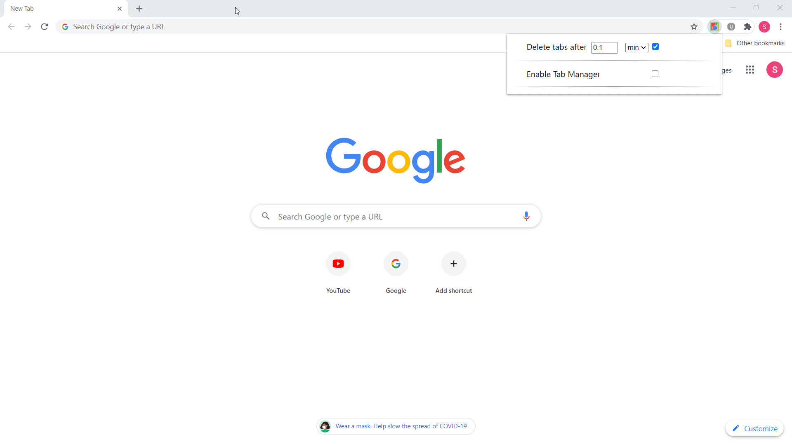

# ANTI-TabHoarder (Alpha version, OUTDATED)
ANTI-TabHoarder is a Google Chrome extension that aims to help tab hoarders control their hoarding and to alleviate CPU stress from an excessive amount of unneccesary tabs running. This version was written in vanilla Javascript before I scrapped it, deciding that implementing all the features I wanted in the Tab Manager functionality would be needlessly difficult when libraries such as React exist to make these things easier. 

## Purpose
I wanted to make this extension for 2 reasons: (1) I hoard tabs and don't close them even when I don't use them and (2) my computer isn't powerful enough to sustain this browsing habit of mines. It's no surprise that Google Chrome uses a lot of CPU power and RAM. That is in part due to Google Chrome creating a different process for each tab. Now, when the memory usage is too high due to the large number of times, then Chrome will combine some into a single process in order to mitigate it. In any case, the most simple and efficient way to reduce CPU strain and lessen RAM usage is to delete open tabs.

#### Why not use an existing extension like OneTab? 
Those extensions are great but I wanted to have more control over what I would be closing and was inspired by Window's Task Manager due to the control and valuable information it gives you over your computer's processes. 

## Features
The extension revolves around two main features: the Auto-Delete & the Tab Manager.

#### Auto-Delete
The Auto-Delete feature acts as a preventative measure for tab hoarders. Once toggled on, tab hoarders will be able to input a certain amount of time in minutes or hours, in which newly created tabs will be deleted after the specified delay. 

Auto Delete UI: 

Auto Delete Functionality Demonstration: 

#### Tab Manager
The Tab Manager, inspired by Window's Task Manager, was supposed to be an interactive table capable of resizing its columns, selecting & highlighting particular rows, and sorting each column by ascending or descending elements. Currently, the table displays the following information about tabs currently open in the window: title of the tab, the last visited date that the user viewed it, & the time elapsed that the user spent viewing it. Users will be able to select any number of tabs from the Tab Manager table & quickly dispose of the tabs based on the information given to them. 
